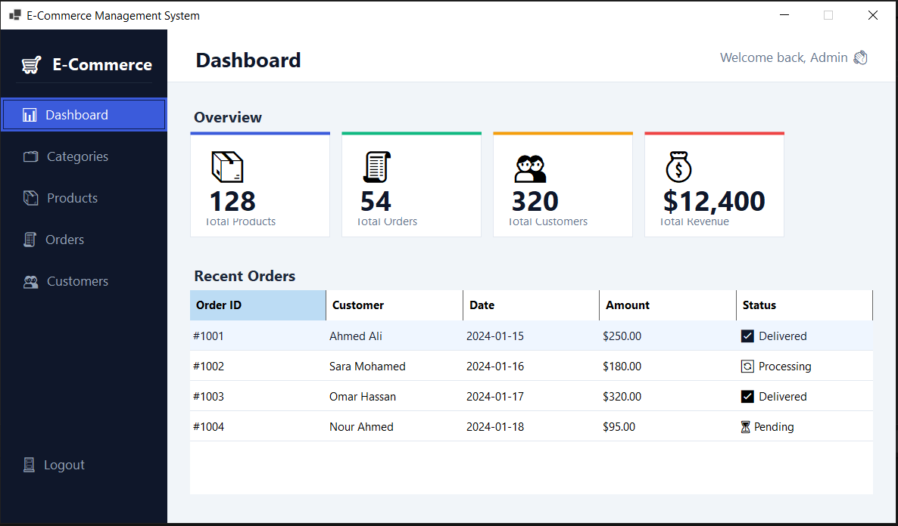
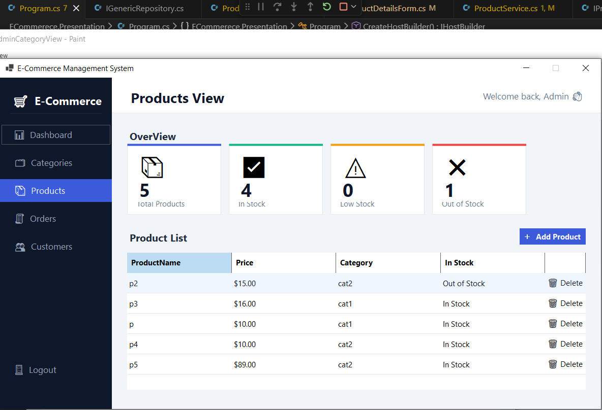
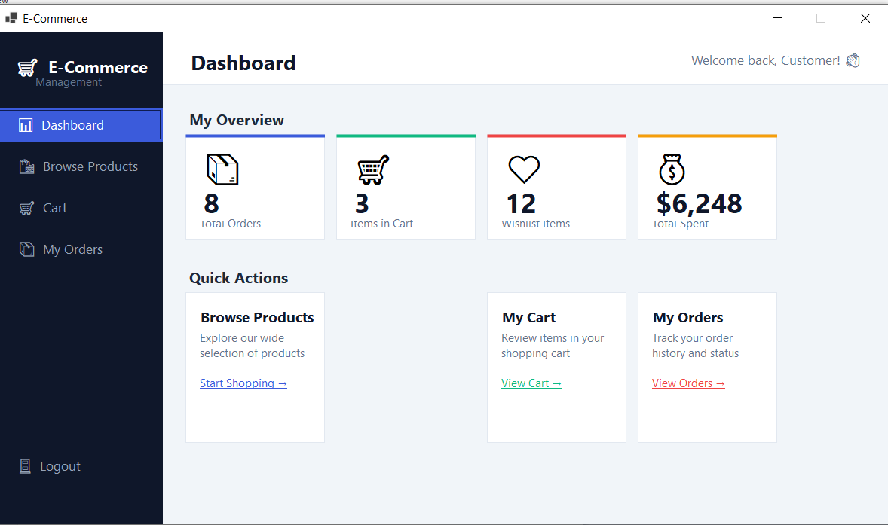
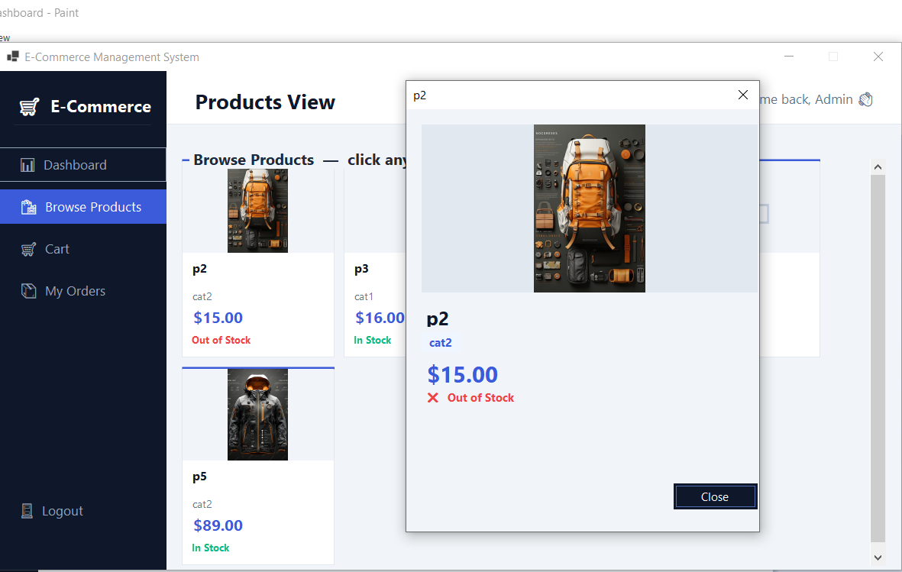
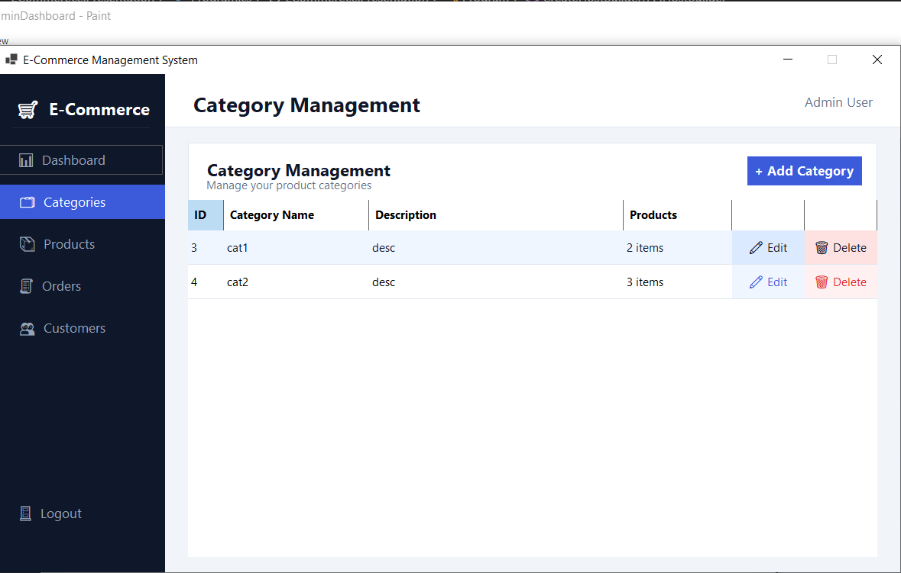

# 🛒 E-Commerce Management System

A Windows Forms desktop app in C# with role-based access for **Admins** and **Customers**, backed by SQL Server via Entity Framework Core.

---

## Screenshots

| Login | Admin Dashboard | Products |
|---|---|---|
|  |  |  |

| Customer Dashboard | Product Browse | Categories |
|---|---|---|
|  |  |  |

---

## What it does

**Admin** — manage categories & products (add, edit, delete), view orders and update their status.

**Customer** — browse and search products, view product details, manage a cart, and place orders.

---

## Stack & Architecture

Clean layered architecture: `Domain → Application → Infrastructure → Presentation`

- **UI:** Windows Forms / C#
- **ORM:** Entity Framework Core + SQL Server
- **DI:** `Microsoft.Extensions.DependencyInjection` with generic host

---

## Setup

1. Set your connection string in `appsettings.json`
2. Run `dotnet ef database update`
3. Run the app — an admin account is seeded automatically on first launch